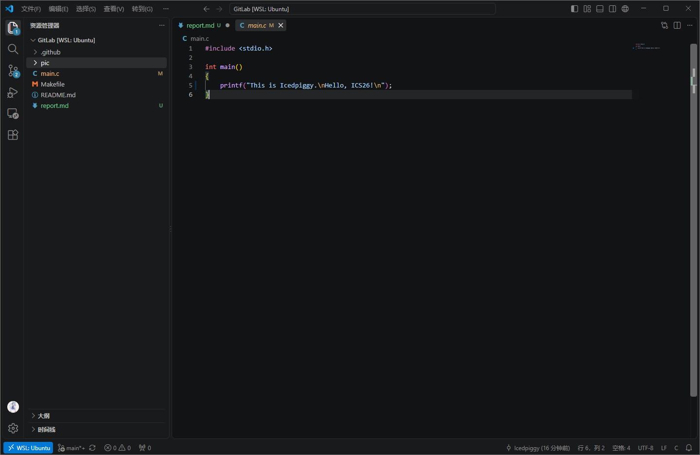
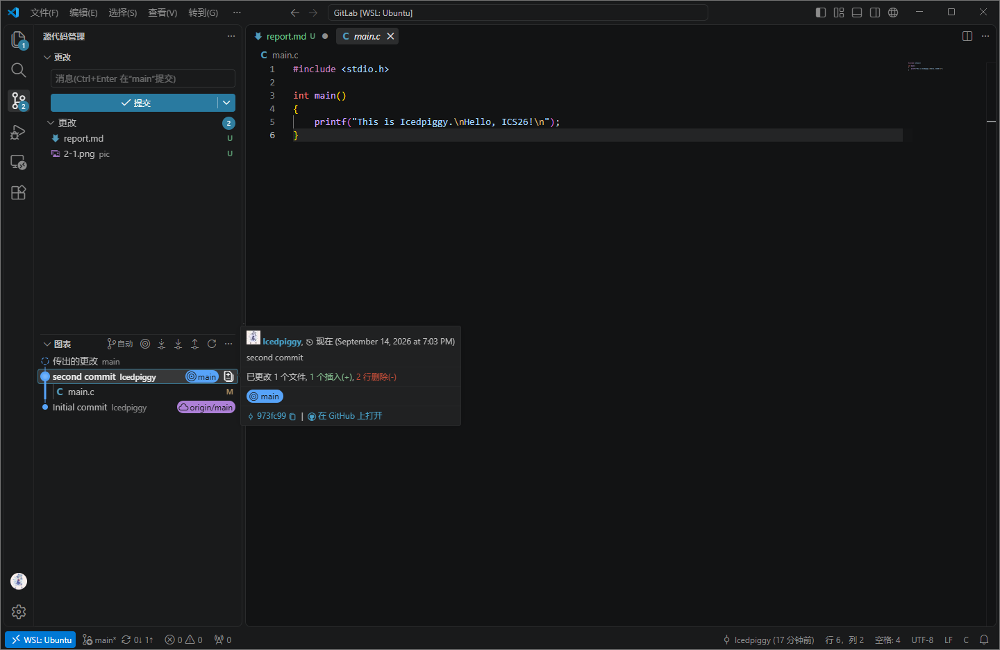
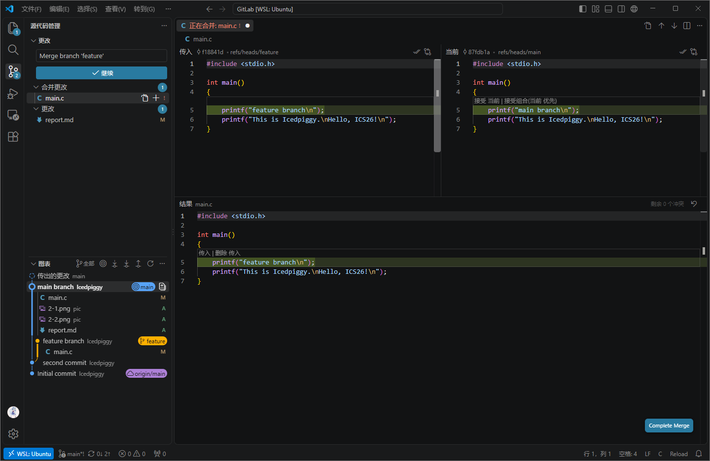
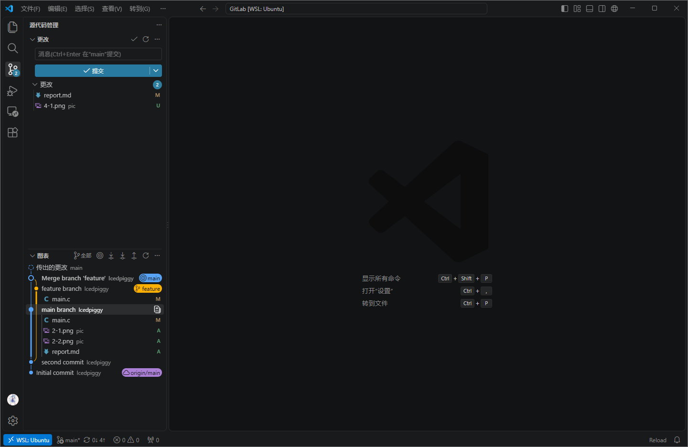

1. 
- 有。双人合作做计算机图形学A的项目，就是使用 github 进行仓库的维护，另一个同学另开一个分支，在提交并推送新更改后发 pull request，然后由我来合并。
- 工作区中的修改可以在暂存区中妥善整理；从而精确地形成一个内容明确、可审查、可回滚的提交。
- `git branch` 默认只显示本地分支。`git branch -a` 显示所有已知分支，包括本地分支和远程跟踪分支。

2. 

3.
- Commit Message 规范（阮一峰）：Commit message 应该清晰明了，应说明本次提交的目的。介绍了 Angular 风格的 Commit message 编写规范（`type(scope): subject + Body + Footer`），以及配套的 Commitizen、validate-commit-msg、conventional-changelog 等工具。
- Git Flow 分支控制（dafaycoding）：讲解了 Gitflow 工作流的五种关键分支（master、develop、feature、release、hotfix）的职责、生命周期与"从哪里来，回哪里去"的合并原则。
- Git 可方便地进行版本管理、可助于并行开发与协作。

4. 
在两个分支分别做如下修改，从而产生冲突。这里选择丢弃 main branch 对 main.c 的修改以解决冲突。

